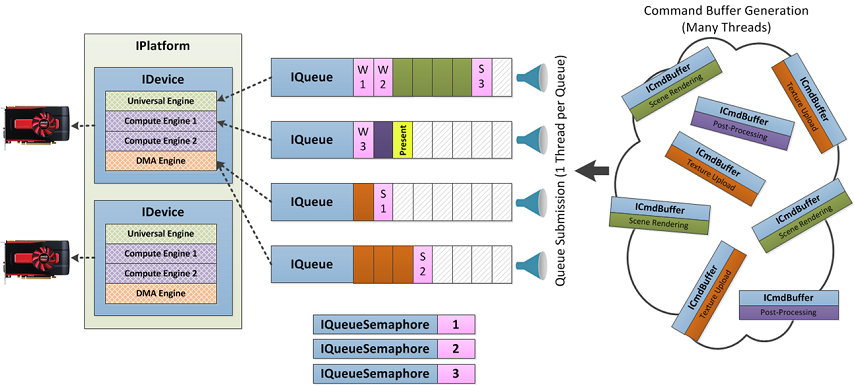

# Platform Abstraction Library (PAL)
The Platform Abstraction Library (PAL) provides hardware and OS abstractions for Radeon&trade; (GCN+) user-mode 3D graphics drivers. The level of abstraction is chosen to support performant driver implementations of several APIs while hiding the client from hardware and operating system details.

PAL client drivers will have no HW-specific code; their responsibility is to translate API/DDI commands into PAL commands as efficiently as possible. This means that the client should be unaware of hardware registers, PM4 commands, etc. However, PAL is an abstraction of AMD hardware only, so many things in the PAL interface have an obvious correlation to hardware features.  PAL does not provide a shader compiler: clients are expected to use an external compiler library that targets PAL's Pipeline ABI to produce compatible shader binaries.

PAL client drivers should have little OS-specific code. PAL and its companion utility collection provide OS abstractions for almost everything a client might need, but there are some cases where this is unavoidable:

* Handling dynamic library infrastructure. I.e., the client has to implement DllMain() on Windows, etc.
* OS-specific APIs or extensions. DX may have Windows-specific functionality in the core API, and Vulkan/Mantle may export certain OS-specific features as extensions (like for presenting contents to the screen).
* Single OS clients (e.g., DX) may choose to make OS-specific calls directly simply out of convenience with no down side.

PAL is a source deliverable. Clients will periodically promote PAL's source into their own tree and build a static pal.lib as part of their build process.

The following diagram illustrates the typical software stack when running a 3D application with a PAL-based UMD:

PAL is a relatively thick abstraction layer, typically accounting for the majority of code in any particular UMD built on PAL, excluding the shader compiler backend. The level of abstraction tends to be higher in areas where client APIs are similar, and lower (closer to hardware) in areas where client APIs diverge significantly. The overall philosophy is to share as much code as possible without impacting client driver performance.

PAL uses a C++ interface. The public interface is defined in .../pal/inc, and clients must only include headers from that directory. The interface is spread over many header files - typically one per class - in order to clarify dependencies and reduce build times. There are three sub-directories in .../pal/inc:

* [inc/core](inc/core) - Defines the [PAL Core](#PAL-Core)
* [inc/util](inc/util) - Defines the [PAL Utility Collection](#Utility-Collection)
* [inc/gpuUtil](inc/gpuUtil) - Defines the [PAL GPU Utility Collection](#GPU-Utility-Collection)

## PAL Core
PAL's core interface is defined in the `Pal` namespace.  It defines an object-oriented model for interacting with the GPU and OS. The interface closely resembles the Mantle, Vulkan, and DX12 APIs. Some common features of these APIs that are central to the PAL interface:

* All shader stages, and some additional "shader adjacent" state, are glommed together into a monolithic pipeline object.
* Explicit, free-threaded command buffer generation.
* Support for multiple, asynchronous engines for executing GPU work (graphics, compute, DMA).
* Explicit system and GPU memory management.
* Flexible shader resource binding model.
* Explicit management of stalls, cache flushes, and compression state changes.

However, as a common component supporting multiple APIs, the PAL interface tends to be lower level in places where client APIs diverge.

### System Memory Allocation

Clients have a lot of control over PAL's system memory allocations. Most PAL objects require the client to provide system memory; the client first calls a `GetSize()` method and then passes a pointer to PAL on the actual create call. Further, when PAL needs to make an internal allocation, it will optionally call a client callback, which can be specified on platform creation. This callback will specify a category for the allocation, which may imply an expected lifetime.

### Interface Classes

The following diagram illustrates the relationship of some key PAL interfaces and how they interact to render a typical frame in a modern game. Below that is a listing of most of PAL's interface classes, and a very brief description of their purpose.

* **OS Abstractions**
    * **`IPlatform`:** Root-level object created by clients that interact with PAL. Mostly responsible for enumerating devices and screens attached to the system and returning any system-wide properties.

    * **`IDevice`:** Configurable context for querying properties of a particular GPU and interacting with it. Acts as a factory for almost all other PAL objects.

    * **`IQueue`:** A device has one or more engines which are able to issue certain types of work. Tahiti, for example, has 1 universal engine (supports graphics, compute, or copy commands), 2 compute engines (support compute or copy commands), and 2 DMA engines (support only copy commands). An `IQueue` object is a context for submitting work on a particular engine. This mainly takes the form of submitting command buffers and presenting images to the screen. Work performed in a queue will be started in order, but work executed on different queues (even if the queues reference the same engine) is not guaranteed to be ordered without explicit synchronization.

    * **`IQueueSemaphore`:** Queue semaphores can be signaled and waited on from an `IQueue` in order to control execution order between queues.

    * **`IFence`:** Used for coarse-grain CPU/GPU synchronization. Fences can be signaled from the GPU as part of a command buffer submission on a queue, then waited on from the CPU.

    * **`IGpuMemory`:** Represents a GPU-accessible memory allocation. Can either be virtual (only VA allocation which must be explicitly mapped via an `IQueue` operation) or physical. Residency of physical allocations must be managed by the client either globally for a device (`IDevice::AddGpuMemoryReferences`) or by specifying allocations referenced by command buffers at submit.

    * **`ICmdAllocator`:** GPU memory allocation pool used for backing an `ICmdBuffer`. The client is free to create one allocator per device, or one per thread to remove thread contention.

    * **`IScreen`:** Represents a display attached to the system. Mostly used for managing full-screen flip presents.

    * **`IPrivateScreen`:** Represents a display that is not otherwise visible to the OS, typically a VR head mounted display.

* **Hardware IP Abstractions**
    * **All IP**
        * **`ICmdBuffer`:** Clients build command buffers to execute the desired work on the GPU, and submit them on a corresponding queue. Different types of work can be executed depending on the queueType of the command buffer (graphics work, compute work, DMA work).

        * **`IImage`:** Images are a 1D, 2D, or 3D collection of pixels (i.e., texture) that can be accessed by the GPU in various ways: texture sampling, BLT source/destination, UAV, etc.

    * **GFXIP-only**
        * **`IPipeline`:** Comprised of all shader stages (CS for compute, VS/HS/DS/GS/PS for graphics), resource mappings describing how user data entries are to be used by the shaders, and some other fixed-function state like depth/color formats, blend enable, MSAA enable, etc.

        * **`IColorTargetView`:** IImage view allowing the image to be bound as a color target (i.e., RTV.).

        * **`IDepthStencilView`:** IImage view allowing the image to be bound as a depth/stencil target (i.e., DSV).

        * **`IGpuEvent`:** Used for fine-grained (intra-command buffer) synchronization between the CPU and GPU. GPU events can be set/reset from either the CPU or GPU and waited on from either.

        * **`IQueryPool`:** Collection of query slots for tracking occlusion or pipeline stats query results.

        * **Dynamic State Objects:** `IColorBlendState`, `IDepthStencilState`, and `IMsaaState` define logical collections of related fixed function graphics state, similar to DX11.

        * **`IPerfExperiment`:** Used for gathering performance counter and thread trace data.

        * **`IBorderColorPalette`:** Provides a collection of indexable colors for use by samplers that clamp to an arbitrary border color.

* **Common Base Classes**
    * **`IDestroyable`:** Defines a `Destroy()` method for the PAL interface. Calling `Destroy()` will release any internally allocated resources for the object, but the client is still responsible for freeing the system memory provided for the object.

    * **`IGpuMemoryBindable`:** Defines a set of methods for binding GPU memory to the object. Interfaces that inherit `IGpuMemoryBindable` require GPU memory in order to be used by the GPU. The client must query the requirements (e.g., alignment, size, heaps) and allocate/bind GPU memory for the object. `IGpuMemoryBindable` inherits from `IDestroyable`.

### Format Info

Several helper methods are available for dealing with image formats in the `Formats` namespace.

## Utility Collection

In addition to its GPU-specific core functionality, PAL provides a lot of generic, OS-abstracted software utilities in the `Util` namespace. The PAL core relies on these utilities, but they are also available for use by its clients.  The features available in `Util` include memory management, debug prints and asserts, generic containers, multithreading and synchronization primitives, file system access, and cryptographic algorithm implementations.

## GPU Utility Collection

In addition to the generic, OS-abstracted software utilities, PAL provides GPU-specific utilities in the `GpuUtil` namespace. These utilities provide common, useful functionality that build on top of the core `Pal` interfaces.  Some examples include an interface for writing text with the GPU, an MLAA implementation, and a wrapper on top of `Pal::IPerfExperiment` to simplify performance data gathering.

## Third Party Software
PAL contains code written by third parties. Such libraries have their own individual LICENSE files in the directory they appear:
* jemalloc: see src/util/imported/jemalloc/jemalloc-license
* Metrohash: see src/util/imported/metrohash/metrohash-license
* rapidjson: see shared/gpuopen/inc/imported/rapidjson/license.txt
