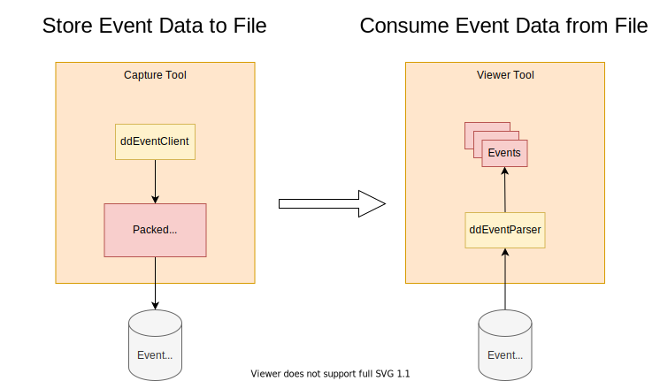
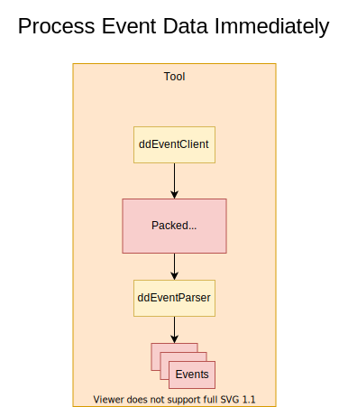

# ddEvent (Asynchronous Data Streaming over DevDriver)

ddEvent is a high-level C API that exposes an asynchronous data streaming interface. A publish/subscribe style event model is used to abstract this functionality. Within this model, clients subscribe to messages (or "events") that they're interested in, and servers publish messages which are sent to any subscribed clients.

# Concepts

## Events

Events are *(unsuprisingly)* the primary focus of the API. They are emitted through **providers** on the server and received by clients. If an application wants to transfer information with this API, they are expected to do so by encoding their information into events.

> The exception to this is when a client would like to influence the behavior of a server by remotely enabling or disabling events or providers.

## Event Providers

Providers are used to scope a collection of individual events into a single context. Providers, like events, have their own identifier values. Applications can combine this identifier with an event identifier to produce a value which uniquely identifies any event received from the network.

## Conceptual View of an Individual Event

> This isn't remotely close to how the data looks in memory. The intention  here is to help developers understand what per-event data is accessible to their applications.

- **Provider Identifier**: Which provider on the server produced this event
- **Event Identifier**: Which type of event this is within the context of its provider
- **Event Index**: Sequence value from the associated provider that increments whenever an event is emitted. (This can be used to detect dropped events)
- **Timestamp**: The time that this event was emitted
- **Timestamp Frequency**: The frequency of the event's timestamp (ticks per second)
- **Payload [Optional]**: Arbitrarily sized data payload associated with the event

## Processing Packed Event Data

All data returned by the `ddEventClient` API is encoded in a special **packed** format. This specialized format yields higher network efficiency via reduced storage requirements. It should be considered **opaque** by developers. Application that need to extract individual events from the **packed** data should use the `ddEventParser` library.

> Developers interested in the internal details of this format can find the specification [here](doc/FORMAT.md).

# System Overview

The entire communication model can be boiled down to these simple steps:
1. Client configures server to enable the desired providers and their events
2. Server emits events
3. Formatted event data is transported across network
4. Client receives formatted event data
5. Client parses formatted event data into events

# Application Usage Scenarios

## Capture Event Data to File

Applications that wish to separate the capturing and processing logic can store captured event data in a file and process it at a later time. (Likely in a different application entirely)

## Real-time Event Processing

Applications that intend to react to events produced by the driver in real-time can feed event data from `ddEventClient` directly into `ddEventParser` for immediate consumption.

# APIs

## `ddEventParser`

This library exists to provide a way for applications to extract individual events and their associated payloads from formatted event data returned by the `ddEventClient` API. It also to provides a layer of separation between the format and the application code to ease backwards compatibility efforts.

## `ddEventClient`

The client API allows applications to:
- Capture formatted event data
- Discover available providers
- Enable or disable providers
- Enable or disable events

## `ddEventServer`

The server API supports creating and destroying provider objects. Applications can use valid provider objects to emit events.
