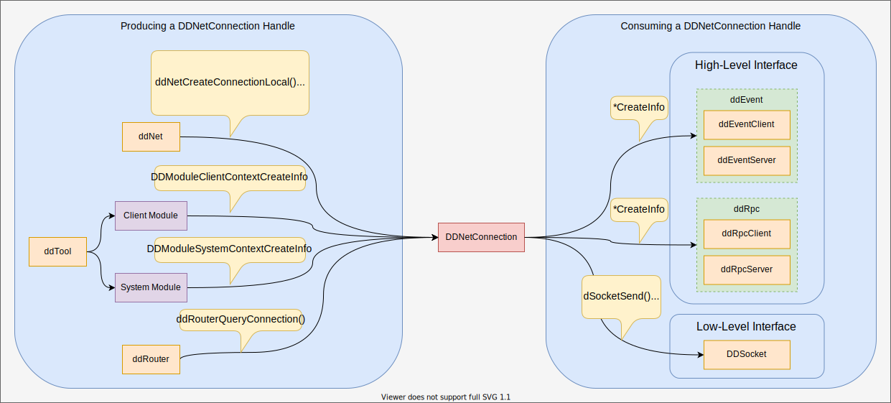

# ddNet

ddNet is a C API that provides access to the DevDriver communication platform. It can be used to create a `DDNetConnection` handle which is a prerequisite for many other DevDriver APIs.

# Connections
A `DDNetConnection` represents a connection from the current application to a network owned by a router.

> See the `ddRouter` API for information about creating networks.

## Local

When the router hosting the network resides on the same machine as the application, a local connection is **recommended**. Local connections take advantage of the fact that the applications are running on the same machine and use a more efficient data transport method.

## Remote

When the router hosting the network resides on a different machine than the application, a remote connection **must** be used. Remote connections use networking functionality provided by the OS to transport data to and from the remote router's network.

## Usage



ddNet's primary purpose is to provide applications with a `DDNetConnection` handle. Once an application acquires a connection, a suite of functionality becomes available through `ddRpc`, `ddEvent`, and `ddSocket` which all consider `DDNetConnection` a prerequisite.

> See the individual documentation pages for `ddRpc`, `ddEvent`, and `ddSocket` for additional details on usage.

# Example

## Local

```cpp
DDNetLocalConnectionInfo connectionInfo = {};
connectionInfo.common.type         = DD_NET_CLIENT_TYPE_TOOL;
connectionInfo.common.pDescription = "Example ddNet Client";

DDNetConnection hConnection = DD_API_INVALID_HANDLE;
const DD_RESULT result = ddNetCreateConnectionLocal(&connectionInfo, &hConnection);
if (result == DD_RESULT_SUCCESS)
{
    // Do work with hConnection

    ddNetDestroyConnection(hConnection);
}
else
{
    // Print the reason for the failure
    printf("Failed to create connection with error: %s", ddNetResultToString(result));
}
```

## Remote

```cpp
DDNetRemoteConnectionInfo connectionInfo = {};
connectionInfo.common.type         = DD_NET_CLIENT_TYPE_TOOL;
connectionInfo.common.pDescription = "Example ddNet Client";
connectionInfo.pHostname           = "EXAMPLE-MACHINE-NAME";

DDNetConnection hConnection = DD_API_INVALID_HANDLE;
const DD_RESULT result = ddNetCreateConnectionRemote(&connectionInfo, &hConnection);
if (result == DD_RESULT_SUCCESS)
{
    // Do  work with hConnection

    ddNetDestroyConnection(hConnection);
}
else
{
    // Print the reason for the failure
    printf("Failed to create connection with error: %s", ddNetResultToString(result));
}
```
