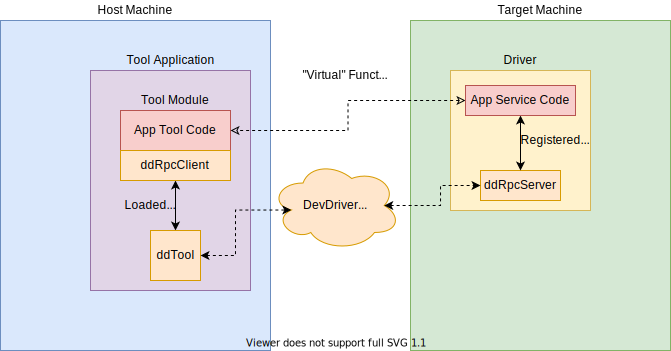
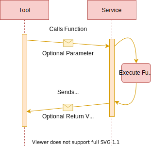

# ddRpc (Remote Procedure Calls over DevDriver)

## Overview

Remote Procedure Call (RPC) is a technique to encapsulate traditional
request-response and REST network APIs into "normal" APIs. Instead of
the client constructing a URL and buffering the response themselves,
they talk to an RPC object with concrete types. This object translates
the function call into the network requests, doing basic validation
along the way.

What this means for driver developers is an easier time exposing
functionality to ddTool modules and tools. It should be much simpler to
write something like the RGP profiling service going forward. With this
updated model, a shared interface file and some scripts can enable the
driver and tool to agree on how to communicate, with no middle man in
DevDriver. This means quicker code changes and faster design iteration
or bug fixes.

First, let's clarify some terminology:

**RPC Server** - This is the object that is responsible for manging
*services*. *Services* register themselves on, and *clients* connect to
this. There is a single *server* in the driver (or anything else that
wishes to host *services*).

**RPC Service** - A single collection of related *functions* that are
defined on the *Server*. Usually this means driver. *Services* are
registered at runtime and may change dynamically. A *service* may or may
not be available under certain circumstances. This is managed by
whatever is hosting the *server*

**RPC Client** - An object that connects to a *service* (through the
*server*, opaquely) and makes requests on *functions*. This is exposed
as method calls on an object. The *service* is accessed over a *message
bus* and should be assumed to be on a remote machine. A main design goal
here is to abstract away the network interface.

**RPC Service Function** - A function authored by the user which takes
an optional parameter and returns an optional value. Functions are
invoked in response to a remote client making a request to execute a
function with an optionally provided parameter. The return value from
the function is sent back to the client as response data.

**Target Machine** - The machine where the driver or target process is
running.

**Host Machine** - The machine where the tool is currently running.
Since tools may be run directly on the target machine, the host machine
and target machine may actually refer to a single machine in certain
usage scenarios.

**DevDriver Message Bus** - A proprietary communication platform used by
AMD drivers and tools. Allows for communication between nodes on the
same machine and also between nodes on different machines that are
accessible via the host machine's network.

## Current Goals

We are currently developing a proof-of-concept design and will begin
making this suitable for use after we get the basics down.

1. It should work
2. It should work all of the time
3. It should have good enough ergonomics

## Known Issues

- The server does not currently implement verification for the max
function parameter size. This should be done to avoid abuse. (#35)

## Design

Our Unit Tests here include a full implementation and example service

### System Overview

### Function Calls

