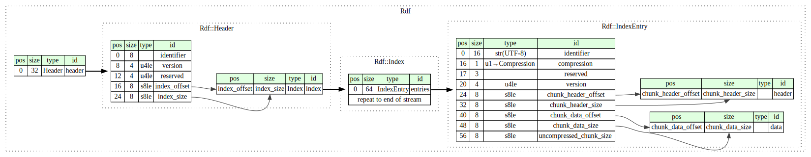

File format specification
=========================

RDF files are structured as following:

* File header
* Data chunks
* Chunk index

All offsets are relative to the file start. All sizes are in bytes. There is no requirement to put the chunk index at the end, but it's convenient for tools which generate RDF files so we expect the index to be at the end. Structures are assumed to be "C" packed.



## File header

```c
struct Header final
{
    char identifier[8];  // "AMD_RDF "
    std::uint32_t version;
    std::uint32_t reserved;

    std::int64_t indexOffset;
    std::int64_t indexSize;
};
```

* `identifier` must be `AMD_RDF `
* `version` is 3
* `reserved` must be set to 0
* `indexOffset` is the offset to the chunk index
* `indexSize` is the size of the index in bytes

The header size must be 32 bytes.

## Chunk index

```c
struct IndexEntry final
{
    char chunkIdentifier[16];
    // The following fields should add up to 4 bytes for alignment
    Compression compression;
    std::uint8_t reserved[3];

    // We'll assume one for all entries by default
    std::uint32_t version = 1;

    std::int64_t chunkHeaderOffset;
    std::int64_t chunkHeaderSize;
    std::int64_t chunkDataOffset;
    std::int64_t chunkDataSize;

    std::int64_t uncompressedChunkSize;
};
```

The index entry size must be 64 bytes.

* `chunkIdentifier` is an identifier with up to 16 bytes. Unused bytes must be set to 0. When used as a string, all bytes can be used.
* `compression` indicates the compression method:

  - 0 for uncompressed
  - 1 for Zstd

* `reserved` must be set to 0
* `version` stores the version of the chunk. This is user-defined, by default 1
* `chunkHeaderOffset` stores the offset to the chunk header data
* `chunkHeaderSize` is the size of the chunk header
* `chunkDataOffset` stores the offset to the chunk data
* `chunkDataSize` is the size of the chunk data (in the file)
* `uncompressedChunkSize` is the size of the chunk after decompression. If the chunk is not compressed, it must be set to 0.

The chunk index can contain the same chunk identifier multiple times.
